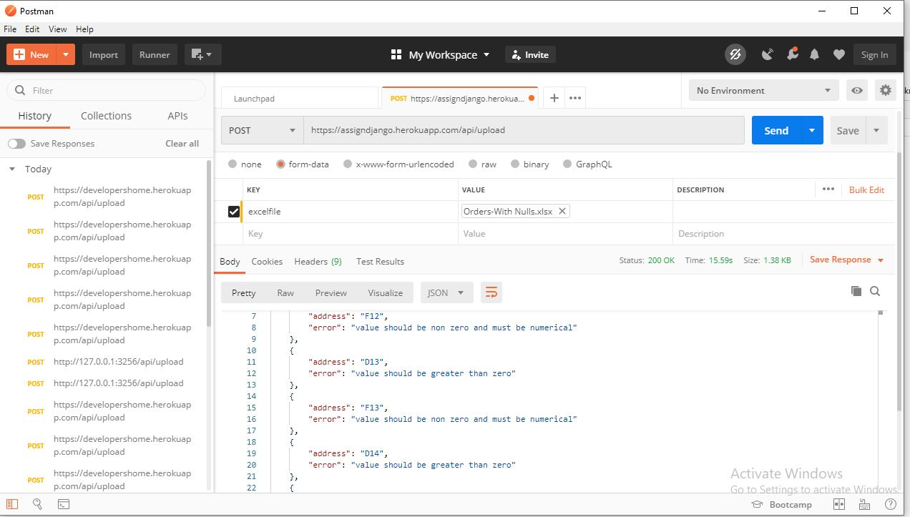
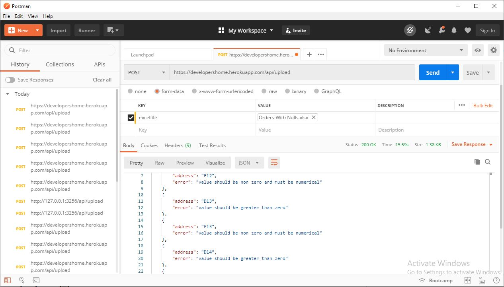
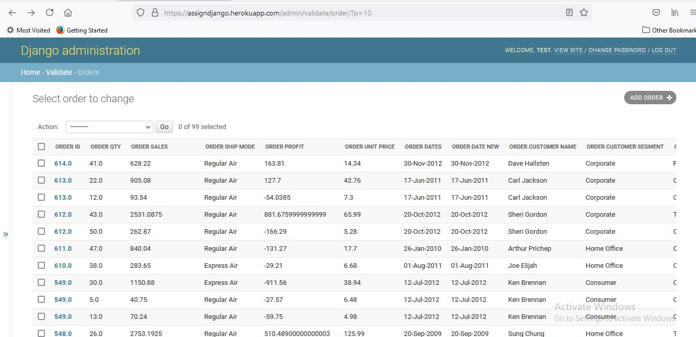

# Django based Excelsheet Data Validator
> Use Docker Deployed API as it is more stable and will not run in 503 Temporary error in Heroku free dyno
> https://assigndjango.herokuapp.com/api/upload  (Docker Deployed on Heroku)\
> https://developershome.herokuapp.com/api/upload  (Normally Deployed on Heroku)

### POSTMAN Preview for Docker Deployed Django app on Heroku


### POSTMAN Preview for Normal Deployed Django app on Heroku


## Features 📋
⚡️ Put Api URL using POST option.\
⚡️ Use **excelfile** as parameter.\
⚡️ Select **File** from dropdown.\
⚡️ Click on **Send** button.\
⚡️ Error Response will be shown as in image.\
⚡️ You can use **Orders-With Nulls.xlsx** present in **unit_test** folder for your reference if you don’t have any.


### Save Data Preview


## Features 📋
⚡️ Correct data is saved in databse for future use.\
⚡️ Can Implement functions to make use of data to its best.\
⚡️ Admin URL for both platform 
> https://assigndjango.herokuapp.com/admin/ \
> https://developershome.herokuapp.com/admin/ \
⚡️ Username : test \
⚡️ Password : iamawesome 

## Installation 📦

>pip install -r requirements.txt

#### Clone

- Clone this repo to your local machine.

#### Run server locally

```shell
$ python manage.py runserver
```
> Go to localhost:8000

## OR
```shell
$ docker build -t web:latest .
$ docker run -d --name django-docker -e "PORT=8765" -e "DEBUG=1" -p 8007:8765 web:latest
```
> Go to localhost:8007

## For Stopping Docker Server
```shell
$ docker stop django-docker
$ docker rm django-docker
```


---

## Contributing 💡


#### Step 1

- **Option 1**
    - 🍴 Fork this repo!

- **Option 2**
    - 👯 Clone this repo to your local machine.


#### Step 2

- **Build your code** 🔨🔨🔨

#### Step 3

- 🔃 Create a new pull request.

